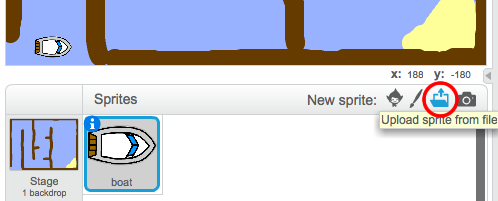
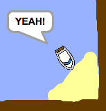
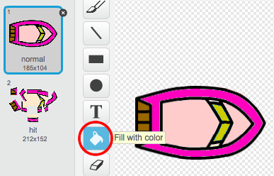

# Einleitung { .intro }

Du wirst lernen ein Spiel zu programmieren, in dem du mit der Maus ein Boot zur einer Insel steuerst.

<div class="scratch-preview">
  <iframe allowtransparency="true" width="485" height="402" src="https://scratch.mit.edu/projects/embed/63957956/?autostart=false" frameborder="0"></iframe>
  
</div>

# Schritt 1: Plane dein Spiel { .activity }

## Arbeitsschritte { .check }

+ Öffne ein neues Scratch-Projekt und lösche die Katzen-Figur, so dass dein Projekt leer ist. Du kannst den online Scratch-Editor hier finden: <a href="http://jumpto.cc/scratch-new">jumpto.cc/scratch-new</a>.

+ Klicke auf Bühnenbilder und zeichne dein Level. Du solltest hinzufügen:
	+ Die Holzbalken, um die dein Boot fahren wird;
	+ Die Insel, zu dem das Boot fahren soll.
	
	Hier ein Beispiel, wie dein Spiel aussehen könnte:

	 

# Schritt 2: Boot steuern { .activity }

## Arbeitsschritte { .check }

+ Wenn du vom Lehrer den Zugang zum 'Resources' Verzeichnis bekommen hast, klicke auf "Figur aus einer Datei laden" und füge die Bilddatei 'boat.png' hinzu. Verkleinere die Figur und stelle sie auf die Startposition.

	

	Wenn du das boat.png image nicht hast, mal dein eigenes Boot!

+ Du wirst das Boot mit deiner Maus Steuern. Füge diesen code zu deinem boot hinzu:

	```blocks
		Wenn die grüne Flagge angeklickt
		setze Richtung auf (0 v)
		gehe zu x:(-190) y:(-150)
		wiederhole fortlaufend
			drehe dich zu [Mauszeiger v]
   			gehe (1) er-Schritt
   		Ende
	```

+ Teste dein Boot, indem du die Flagge anklickst und die Maus bewegst. Segelt das Boot in Richtung der Maus?

	

+ Was passiert wenn das Boot den Mauszeiger berührt?

	Um es zu verhindern, füge ein `falls` {.blockcontrol} Skript zu deinem Code hinzu, sodass sich das Boot nur bewegt, wenn es mehr als 5 Pixel von der Maus entfernt ist.

		

+ Teste dein Boot wieder und überprüfe, ob das Problem gelöst ist.

## Speichere dein projekt { .save }

# Schritt 3: Unfall! { .activity .new-page }

Dein Boot kann durch die braunen Holzbalken hindurch segeln! Das ändern wir jetzt.

## Arbeitsschritte { .check }

+ Du brauchst 2 Kostüme für dein Boot: Ein normales Kostüm, und eins für ein kaputtes Boot. Dupliziere das Boot Kostüm, und nenne sie 'Normal' und 'Kaputt'.

+ Klicke dein 'Kaputt' Kostüm und dann das 'Auswählen' Werkzeug an. Damit zerlegst du das Boot in Teile, bewegst und drehst sie. Lasse das Boot so aussehen als hätte es einen Unfall gebaut.

	

+ Füge diesen Code zu deinem Boot hinzu, innerhalb der `wiederhole fortlaufend` {.blockcontrol} Schleife. Damit baut dein Boot jedes mal einen Unfall, wenn es einen der braunen Holzbalken berührt:

	```blocks
		falls <wird Farbe [#603C15] berührt?> dann
   			wechsle zu Kostüm [hit v]
   			sage [Oh nein!] für (1) Sek.
  			wechsle zu Kostüm [normal v]
  			setze Richtung auf (0 v)
   			gehe zu x:(-215) y:(-160)
		Ende
	```

	Dieser Code gehöhrt in die `wiederhole fortlaufend` {.blockcontrol} Schleife, sodass dein Code immer prüft, ob das Boot einen Unfall gebaut hat oder nicht.

+ Stelle sicher, dass dein Boot immer in dem 'Normal' Zustand startet.

+ Wenn du nun versuchst durch einen Holzbalken zu segeln, wirst du sehen, dass dein Boot kaputt geht und zum Start zurückkehrt.

	

## Speichere dein Projekt { .save }

## Herausforderung: Gewinnen! {.challenge}
Kannst du noch ein `falls` {.blockcontrol} Skript zu dem Code deines Bootes, sodass der Spieler gewinnt wenn er zur Wüsteninsel kommt?

Wenn das Boot zur gelben Wüsteninsel kommt, soll es 'JA-A-A!' sagen und das Spiel soll anhalten. Du wirst diesen Code benötigen:

```blocks
	sage [JA-A-A!] für (1) Sek.
	stoppe [alles v]
```



## Speichere dein Projekt { .save }

## Herausforderung: Musik effekte {.challenge}
Kannst du Musikeffekte zu deinem Spiel hinzufügen, falls dein Boot einen Unfall baut oder die Insel erreicht? Du könntest sogar Hintergrundmusik einfügen (schau dir das letzte projekt 'Rock-Band' an, wenn du Hilfe brauchst).

## Speichere dein Projekt { .save }

# Step 4: Zeitfahren { .activity }

Lass uns einen Timer zum Spiel hinzufügen. Damit soll der Spieler versuchen, so schnell wie möglich zur Wüsteninsel zu kommen.

## Arbeitsschritte { .check }

+ Füge eine neue Variable  namens `Zeit` {.blockdata} zu deiner Bühne hinzu. Du kannst auch das Aussehen  der Variable ändern. Wenn du Hilfe brauchst schaue dir das 'Luftballons' Projekt an.

	

+ Füge diesen Code zu deiner __Bühne__ hinzu, sodass der Timer läuft bis das Boot an der Wüsteninsel ankommt:

	```blocks
		Wenn die grüne Flagge angeklickt
		setze [time v] auf [0]
		wiederhole fortlaufend
   			warte (0.1) Sek.
  			ändere [time v] um (0.1)
		Ende
	```

+ Das war's! Teste dein Spiel und versuch, so schnell wie möglich zur Wüsteninsel zu kommen.

	

## Speichere dein Projekt { .save }

# Step 5: Hindernisse und Schübe { .activity }

Dieses Spiel ist _viel_ zu leicht - Lass uns ein paar Dinge hinzufügen, um es spannender zu machen.

## Arbeitsschritte { .check }

+ Als erstes füge ein paar 'Schübe' zu deinem Spiel, die das Boot beschleunigen. Ändere deinen Bühnen backdrop und füge ein paar weiße Schubpfeile hinzu.

	

+ Füge jetzt einen anderen Code zu deiner `wiederhole fortlaufend` {.blockcontrol} Schleife hinzu, sodass es 2 _extra_ Schritte macht, wenn es über einen Schubpfeil fährt.

	```blocks
		falls <wird Farbe [#FFFFFF] berührt?> dann
   			gehe (3) er-Schritt
		Ende
	```

+ Du kannst ein drehendes Tor erstellen, das dein Boot meiden soll. Füge ein neues Kostüm dazu und nenne es 'Tor'. So soll es aussehen:

	

	Die Farbe des Tors soll mit der Farbe der Holzbalken übereinstimmen.

+ Markiere den Drehpunkt des Kostüms.

	

+ Füge den Code `wiederhole fortlaufend` {.blockcontrol} hinzu, damit sich das Tor sich langsam dreht.

+ Teste das Spiel. Jetzt sollst du ein drehendes Tor sehen, dass du lieber umschiffen sollst.

	

## Speichere dein Projekt { .save }

## Herausforderung: Noch mehr Hindernisse! {.challenge .new-page}
Kannst Du noch mehr Hindernisse in dein Spiel einbauen? Hier sind ein paar Ideen:

+ Du kannst einen Schlammgebiet ins Bühnenbild einfügen, das das Boot verlangsamt, wenn es in den Schlamm reinsegelt. Nutze dafür das `warte` {.blockcontrol} Skript:

```blocks
	warte (0.01) Sek.
````


+ Du kannst ein Objekt einfügen, das sich ständig bewegegt, z.B. einen Holzklotz oder einen Hai sein!


Diese Skripte können dir helfen:

```blocks
	gehe (1) er-Schritt
	pralle vom Rand ab
````

Wenn das neue Objekt ist nicht braun, denke dran, seine Farbe im Code aufzunehmen:

```blocks
	falls <<wird Farbe [#603C15] berührt?> oder <wird [shark v] berührt?>> dann
	Ende
```

## Speichere dein Projekt { .save }

## Herausforderung: Mehr Boote! {.challenge .new-page}
Kannst du das Spiel so ausbauen, dass zwei Spieler das gleichzeitig spielen können.

+ Dupliziere das Boot, nenne es 'Spieler 2' und ändere seine Farbe.



+ Ändere die Startposition des Spieler 2, indem du diesen Code änderst:

```blocks
	gehe zu x:(-190) y:(-150)
```

+ Lösche den Code für die Maussteuerung:

```blocks
	falls <(Entfernung von [Mauszeiger v]) > [5]> dann
   		drehe dich zu [Mauszeiger v]
   		gehe (1) er-Schritt
	Ende
```

...und ersetze ihn mit dem Code für die Tastatursteuerung mit den Pfeiltasten.

Mit diesem Code wird das Boot vorwärts bewegt:

```blocks
	falls <Taste [Pfeil nach oben v] gedrückt?> dann
   		gehe (1) er-Schritt
	Ende
```

Du brauchst auch den Code zum `drehen` {.blockmotion} des Boots, wenn der Spieler auf die Pfeiltasten 'Links' oder 'Rechts' drückt.

## Speichere dein Projekt { .save }

## Herausforderung: Weitere Levels! {.challenge .new-page}
Kannst du weitere Bühnen erstellen und dem Spieler erlauben, einen Level auszuwählen?

```blocks
	Wenn Taste [Leertaste v] gedrückt
	nächstes Bühnenbild
```

## Speichere dein Projekt { .save }

## Community Contributed Translation { .challenge .pdf-hidden }

This project was translated by Ilja Gendler and Oleg Bascurov. Our amazing translation volunteers help us give children around the world the chance to learn to code.  You can help us reach more children by translating a Code Club project via [Github](https://github.com/CodeClub/curriculum_documentation/blob/master/contributing.md) or by getting in touch with us at hello@codeclubworld.