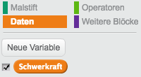
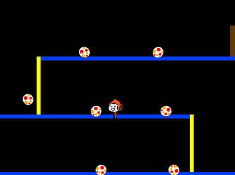
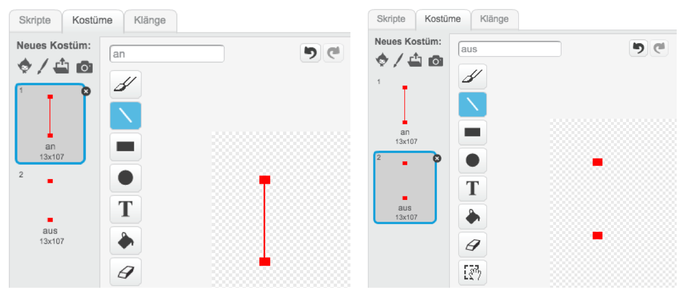
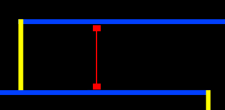
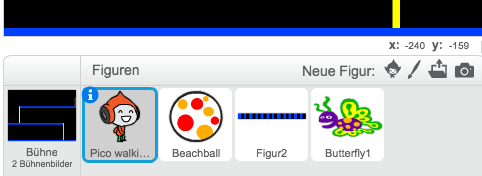
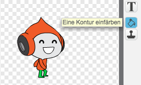

# Einführung { .intro }

In diesem Projekt lernst Du, wie Du ein Plattform-Spiel erstellst, in dem Du sich bewegenden Bällen ausweichen und das Ende des Levels erreichen musst.

<div class="scratch-preview">
  <iframe allowtransparency="true" width="485" height="402" src="https://scratch.mit.edu/projects/embed/39740618/?autostart=false" frameborder="0"></iframe>
  
</div>

# Schritt 1: Bewegung der Spielfigur { .activity }

Lass uns damit starten, dass wir eine Spielfugur erstllen, die sich sowohl nach rechts und links bewegen, als auch springen und Mäste hochklettern kann.

## Arbeitsschritte { .check }

+ Starte ein neues Projekt und lösche die bestehende Figur, so dass Dein Projekt leer ist. Du kannst das Online-Bearbeitungstool hier finden: <a href="http://jumpto.cc/scratch-new">jumpto.cc/scratch-new</a>.

+ Für dieses Projekt solltest Du einen 'Project Resources'Órdner hqbenm yelcher dqs Hintergrundbild enthält, das Du benötigst. Stelle sicher, dass Du diesen Ordner hast und farage Deinen Club-Leiter, falls Du diesen nicht finden kannst.

	

+ Füge das Bild 'background.png' als Bühne hinzu oder zeiche Deinen eigenen Hintergrund! Wenn Du Dein eigenes Level erstellst, solltest Du nur sicherstellen, dass die Mäste und Böden andere Farben haben und dass es eine Tür (oder etwas Ähnliches) gibt, die Dein Spieler erreichen muss. So sollte Dein Projekt aussehen:

	

+ Füge eine neue Figur hinzu, die Dein Spielcharakter sein wird. Es ist besser, wenn Du eine Figur mit mehreren Kostümen aussuchst, so dass Du es so aussehen lassen kannst, als ob es tatsächlich geht.

	

+ Lass uns die Pfeile benutzeb, um Deinen Charakter umherzubewegen. Wenn der Spieler der rechten Pfeil anklickt, sollte sich Dein Charekter nach rechts drehen, einige Schritte gehen und zum nächsten Kostüm wechseln:

	```blocks
		Wenn die grüne Flagge angeklickt
		wiederhole fortlaufend
		   falls <Taste [Pfeil nach rechts v] gedrückt?> dann
		      setze Richtung auf (90 v)
		      gehe (3) er-Schritt
		      nächstes Kostüm
		   Ende
		Ende
	```

+ Teste Deinen Charakter indem Du auf die Fahne klickst und den Rechtspfeil gedrückt hältst. Bewegt sich Deine Spielfigur nach rechts? Sieht Deine Figur so aus, als ob sie wirklich geht?

	

+ Um Deine Figur nach links zu bewegen, musst Du einen weiteren `wenn` {.blockcontrol}-Block in Deine `forever` {.blockcontrol}-Schliefe einbauen. Vergiss nicht Deinen Code zu testen, um sicherzustellen, dass er funktioniert!

+ Um einen Mast hochklettern zu können, sollte sich Deine Spielfigur leicht nach oben bewegen, sobald der Hoch-Pfeil gedrückt wird und die Figur die richtige Farbe berührt wird. Füge diesen Code in die `forever` {.blockcontrol}´Schleife der Spielfigur hinzu:

	```blocks
		falls <<Taste [Pfeil nach oben v] gedrückt?> und <wird Farbe [#FFFF00] berührt?>> dann
		   ändere y um (4)
		Ende
	```

+ Teste Deine Spielfigur. Kann es die gelben Masten hochklettern und so das Ende des Levels erreichen?

	

## Speichere Dein Projekt { .save }

## Herausforderung: Das Level abschließen {.challenge}
Kannst Du Deiner Spielfigur mehr Code hinzufügen, so dass Sie etwas sagen, `wenn` {.blockcontrol} Sie die braune Tür erreicht haben?


## Speichere Dein Projekt { .save }

# Schritt 2: Schwerkraft und springen { .activity }

Lass uns die Bewegungen Deines Charakters relistischer erscheinen lassen, indem wir Schwerkraft hinzufügen und sie springen lassen.

## Arbeitsschritte { .check }

+ Du hast vielleicht schon festgestellt, dass Deine Figur von einer Plattform in die Luft gehen kann. Versuche von einer Plattform zu gehen und beobachte, was passiert!

	

+ Um dies zu berictigen,lass uns Schwerkraft zu Deinem Spiel hinzufügen. Erstelle eine neue Variable names `Schwerkraft` {.blockdata}. Du kannst Die Variable von der Bühne verstecken, wenn Du möchtest.

	

+ Füge diesen neuen Code-Block hinzu, welcher die Schwerkraft zu einer negativen Nummer setzt und dies nutzt, um ko,tinuierliche die y-Koodinaten Deiner Spielfigur anzupassen.

	```blocks
		Wenn die grüne Flagge angeklickt
		setze [Schwerkraft v] auf [-4]
		wiederhole fortlaufend
		   ändere y um (Schwerkraft)
		Ende
	```

+ Klicke auf die Fahen und ziehe Deine Spielfigur an die Decke der Bühne. Was passiert? Funktioniert die Schwerkraft so, wie Du es erwartet hast?

	

+ Die Schwerkraft sollte Deinen Charakter jedoch nicht durch einen Mast oder eine Plattform bewegen. Füge einen `wenn` {.blockcontrol}-Block zu Deinem Code hinzu, so dass Deine Schwerkraft nur greift, wenn sich die Figur in der Luft befindet. Der Schwerkraft-Code sollte so aussehen:

	```blocks
		Wenn die grüne Flagge angeklickt
		set [Schwerkraft v] to [-4] ^
		wiederhole fortlaufend
		   falls <nicht <<wird Farbe [#0000FF] berührt?> oder <wird Farbe [#FFFF00] berührt?>>> dann
		      ändere y um (Schwerkraft)
		   Ende
		Ende
	```

+ Teste wieder die Schwerkraft. Stoppt Deine Figur wenn Sie einen Mast oder Plattform berührt? Kannst Du am Ende einer Plattform auf das untere Level heruntersteigen?

	

+  Lass uns Deine Figur zum Springen bringen, wenn der Spieler die Leertaste drückt. Du kannst auf eine einfache Weise Deine Figur einige Male hoch- und runter bewegen, indem Du diesen Code hnzufügst.

	```blocks
		Wenn Taste [Leertaste v] gedrückt
		wiederhole (10) mal
		   ändere y um (4)
		Ende
	```

	Da die Schwerkraft deine Figur kontinuierlich um 4 Pixels herunterbewegt, musst Du eine größere Zahl als 4 in Deinem `change y by (4)` {.blockmotion}-Block nehmen. Verändere die Nummer so lange, bis Du zufrieden bist mit der Höhe, die Deine Spielfigur springt.

+ Wenn Du den Code testest, wirst Du feststellen, dass er funktionuert. Allerdings sind die BEwegungen nicht sehr flüssig. Um das Springen natürlicher aussehen zu lassen, musst du die BEwegungen der Figur kleiner und kleiner wwerden lassen, bis sie nicht mehr springt.

+ Um dies zu tun, erstelle eine weitere Variable, die `jump height` {.blockdata} heißt. Auch hier kannst Du die Variable von der Bühne verstecken, wenn Du möchtest.

+ Lösche den Springen-Code, den Du Deinem Charakter hinzugefügt hast und ersetzte ihn stattdessen mit diesem:

	```blocks
		Wenn Taste [Leertaste v] gedrückt
		setze [jump height v] auf [8]
		wiederhole bis <(jump height) = [0]>
		   ändere y um (jump height)
		   ändere [jump height v] um (-0.5)
		Ende
	```

	Dieser Code bewegt Deinen Charakter um 8 Pixel nach oben, dann um 7.5 Pixels, dann um 7 und so weiter, bis Deine Figur nicht mehr springt. Das lässt das Springen viel flüssiger erscheinen.

+ Verändere den Startwert deiner Sprunghöhe / `jump height` {.blockdata}-Variable und teste sie, bis Du zufrieden mit der Höhe, die Deine Figur springt.

## Speichere Dein Projekt { .save }

## Herausforderung: Vernessertes Springen {.challenge}
Deine Figur springt immer dann, wenn die ENTER-Taste gedrückt wird, auch dann, wenn sie sich noch in der Luft befindet. Du kannst es testen, indem Du einfach die ENTER-Taste gedrückt hältst. Kannst Du dies verbessern, so dass Deine Figur nur dann springt, `wenn` {.blockcontrol} sie eine blaue Plattform berührt?

## SSpeichere Dein Projekt { .save }

# Step 3: Springende Bälle { .activity .new-page}

Jetzt, da sich Deine Figur umherbewegen kann, lass uns Bälle hinzufügen, denen sie ausweichen muss.

## Arbeitsschritte { .check }

+ Erstelle eine neue Figur. Du kannst jede Art von Ball auswählen, die Du möchtest.

	

+ Verändere die Größe des Balls, so dass Deine Spielfigur über diesen springen kann. Versuche über den Ball zu springen, um es zu testen.

	

+ Füge Deinem Ball diesen Code hinzu:

	

	Dieser Code erstellt alle 3 Sekunden einen neuen Ball-Klon. Jeder neue Klon bewegt sich entlang der oeberen Plattform.

+ Klicke auf die Fahne, um dies zu testen.

	

+ Füge dem Ball mehr Code hinzu, so dass sie sich entlang aller Plattformen bewegen.

	

+ Zum Schluss, brauchst Du einen Code, der bestimmt was passiert, wenn Deine Spielfigur von einem Ball getroffen wird! Füge diesen Code Deiner Ball-Figur hinzu:

	```blocks
		Wenn ich als Klon entstehe
		wiederhole fortlaufend
		   falls <wird [Pico walking v] berührt?> dann
		      sende [hit v] an alle
		   Ende
		Ende
	```

+ Du wirst auch Deiner Spielfigur einen Code hinzufügen, der bestimmt, dass die Figur zurück an den Start gehen muss, wenn sie getroffen worden ist:

	```blocks
		Wenn ich [hit v] empfange
		setze Richtung auf (90 v)
		gehe zu x:(-210) y:(-120)
	```	

+ Teste Deinen Spielcharakter und siehe, ob die Figur an den Start zurückversetzt wird, wenn Sie einen Ball berührt.

## Speichere Dein Projekt { .save }

## Herqusforderung: Willkürliche Bälle {.challenge}
Die Bälle, die Deine Figur umgehen muss, sehen alle gleich aus und tauchen alle 3 Sekunden auf. Kannst Du sie verbessern, damit sie:

+ nicht alle gleich aussehen?
+ nach einer willkürlichen WZeit erscheinen?
+ eine willkürliche Grüße haben?


## Speichere Dein Projekt { .save }

# Schritt 4: Laser! { .activity .new-page}

Lass uns Dein Spile noch schwieriger machen, indem wir Laser hinzufügen!

## Arbeitsschritte { .check }

+ Füge Deinem Spiel eine neue Figur hinzu, die 'Laser' heißt. Sie sollte wyei Kostüme haben, die 'an' und 'aus' heißen.

	

+ Platziere Deinen Laser wo immer Du möchtest zwischen zwei Plattformen.

	

+ Füge Dinem Laser einen Code hinzu, um ihn zwischen zwei Kostümen wechseln zu lassen.

	```blocks
		Wenn die grüne Flagge angeklickt
		wiederhole fortlaufend
		   wechsle zu Kostüm [an v]
		   warte (2) Sek.
		   wechsle zu Kostüm [aus v]
		   warte (2) Sek.
		Ende
	```

	Wenn Du möchtest, kannst Du eine willkürliche / `random` {.blockoperators} Zeit `warten` {.blockcontrol}, bevor das Kostüm wechselt.

+ Füge anschließend Deinem Laser einen Code hinzu, so dass die 'hit'-Nachricht verbreitet wird, sobald der Laser Deine Figur berührt. Dieser Code wird der gleiche sein, den Du Deiner Ball-Figur hinzugefügt hast.

	Du musst Deiner Figur keinen weiteren Code hinzufügen - sie weiß bereits was zu tun ist, wenn sie berührt wird.

+ Teste Dein Spiel darauf, ob Du es schaffst den Laser zu passieren. Ändere die `wait` {.blockcontrol}´-Zeit in Deinem Code, wenn die Laser zu einfach oder zu schwierig zu umgehen sind.

## Herausforderung: Mehr Hindernisse {.challenge}
Wenn Du findest, dass Dein Spiel immer noch zu einfach ist, kannst Du Deinem Level mehr Hindernisse hinzufügen. Du kannst alles hinzufügen, was Du möchtest. Hier sind jedoch einige Ideen:

+ Einen Killer-Schmetterling;
+ Plattformen, die auftauchen und ver;
+ Falling tennis balls that must be avoided.



Du könntest sogar mehr als einen Hintergund erstellen und zum nächsten Level übergehen, sobald Deine Spielfigur die Tür erreicht hat:

```blocks
		falls <wird Farbe [#714300] berührt?> dann
		   wechsle zu Bühnenbild [nächstes Bühnenbild v]
		   gehe zu x:(-210) y:(-120)
		   warte (1) Sek.
		Ende
```

## Speichere Dein Projekt{ .save }

## Herausforderung: Verbesserte Schwerkraft {.challenge}
Es gibt einen kleinen Bug in Deinem Spiel: die Schwerkraft zieht Deine Figur nicht nach unten wenn irgendein Teil (if _any_ part) dessen, die blaue Plattform berührt - sogar wenn es sein Kopf ist!  Du kannst es testen, indem Du irgendeinen Mast heraufkletterst und die Figur dann nach links bewegst.


Kannst Du den Bug beseitigen? Um dies zu tun, musst Du Deiner Spielfigur unterschiedlich farbige Hosen geben (für allen Kostüme (on _all_ costumes))...



...und dann diesen Code ersetzen: 

```blocks
	wird Farbe [#0000FF] berührt?
```

mit:

```blocks
	Farbe [#00FF00] berührt [#0000FF]?
```

Denke daran die Verbesserung auszuprobieren, um zu testen, ob der Bug tatsächlich entfernt ist!

## Speichere Dein Projekt{ .save }

## Herausforderung: Mehr Leben {.challenge}
Kannst Du Deinem Spieler drei `Leben` {.blockdata} geben, anstatt ihn immer wieder einfach zum Ausgangspunkt zu senden? So könnte Dein Spiel funktionieren:

+ Dein Spieler startet mit drei Leben;
+ Jedes Mal, wenn Dein Spieler getroffen wird, verliert man ein Leben und muss zum Ausgangspunkt zurückkehren;
+ Sobald keine Leben mehr über sind, ist das Speil verloren.

## Speichere Dein Projekt { .save }