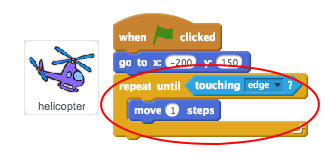
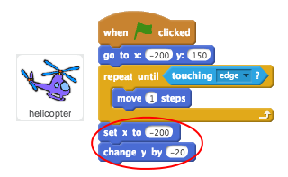
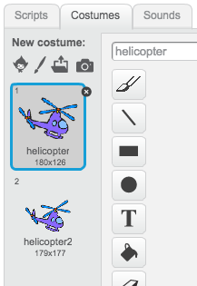
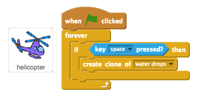
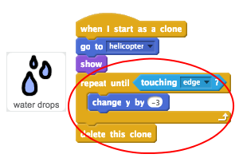
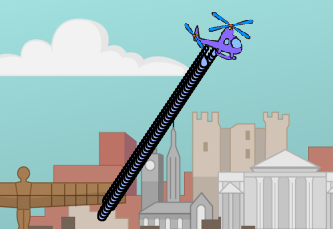
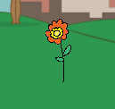

# Introduction { .intro }

You are going to learn how to create a game in which a helicopter scores points by watering flowers in the city.

  <iframe allowtransparency="true" width="485" height="402" src="https://scratch.mit.edu/projects/embed/110929020/?autostart=false" frameborder="0"></iframe>
  

# Step 1: Helicopter { .activity }

Let's code your helicopter to move across the stage.

## Activity Checklist { .check }

+ Open the 'Green Your City' Scratch project. Your club leader will give you a copy of this project, or you can open it online at <a href="http://jumpto.cc/city-resources" target="_blank">jumpto.cc/city-resources</a>.

	Here's how the project should look:

	

+ Click your stage and then click 'Backdrops'. You can then choose a different city backdrop for your game. You can even click the 'Choose backdrop' button to choose a different backdrop from the Scratch library.

	

+ Add this code so that your helicopter starts in the top-left of the stage.

	

+ Add code so that your helicopter moves to the right until it reaches the edge of the stage.

	

+ Test your helicopter by clicking the green flag. It should move across the top of the stage until it reaches the other side.

	

+ Once it has reached the edge, your helicopter should go back to the left side of the stage and move down slightly.

 	

 	Notice that the blocks you need to use are `set x` {.blockmotion} and `change y` {.blockmotion}.

+ Finally, you need to repeat this movement until your helicopter is at the bottom of the screen (its y position is less than -90).

 	

+ Test your helicopter again. It should move across and down until it gets to the bottom of the stage.

	You can make testing quicker by speeding up your helicopter.

	 

## Save your project { .save }

## Challenge: Animate your helicopter {.challenge}
You may have noticed that your helicopter has 2 slightly different costumes.

Can you use this block to animate your helicopter as it moves?

## Save your project { .save }

# Step 2: Water { .activity }

Let's code your helicopter to drop water onto your flowers.

## Activity Checklist { .check }

+ Add code to your __helicopter__ sprite, to create a new water drops clone whenever the space key is pressed.

	

+ Add code to your __water drops__ sprite, so that it is hidden when the game starts.

	

+ You can then add code so that each new clone appears wherever the helicopter is.

	

+ Test your code by clicking the flag and then pressing the space bar. A water drop clone should appear whenever space bar is pressed.

	

+ Now you need to make the water drops fall to the ground.

	

+ Test your water drops again. This time they should fall to the ground.

	

## Save your project { .save }

## Challenge: Too much water {.challenge}
Have you noticed that lots of water is dropped if you hold down the space bar?

Can you use either (or both) of these blocks to fix the problem?

## Save your project { .save }

# Step 3: Flowers { .activity }

Let's code your flowers to grow when they are watered.

## Activity Checklist { .check }

+ Add code to your __red flower__ sprite to move it to the bottom of the stage at the start of the game.

	

+ Your flower should move upwards whenever it's touching a water drop.

	

+ Click the green flag and then test your red flower by dropping some water drops onto it. Does the red flower move upwards when hit?

	Have you noticed that your flower __keeps__ moving up when it's touching the water?

	

	Can you add a `wait` {.blockcontrol} block so that the flower only moves up once each time.

+ Copy your red flower code to your other flower sprites. To do this, just drag the code onto the other sprites.

	

## Save your project { .save }

## Challenge: Keeping score {.challenge}
Can you add a `score` {.blockdata} variable to your game? Your score should start at 0, and change by 1 whenever a flower is hit by a water drop.

Here are the code blocks you'll need:

## Save your project { .save }

## Challenge: Floating flowers {.challenge}
Have you noticed that if you water your flowers enough times that they move too high?

You only want your flowers to move up the stage if they're touching the water `and` {.blockcontrol} their `y position` {.blockmotion} is less than -150.

If a flower's position is higher than -150 then it should move any further.

Here are the code blocks you'll need:

## Save your project { .save }
