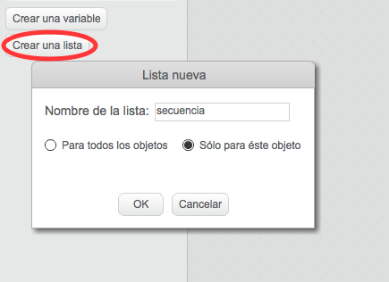
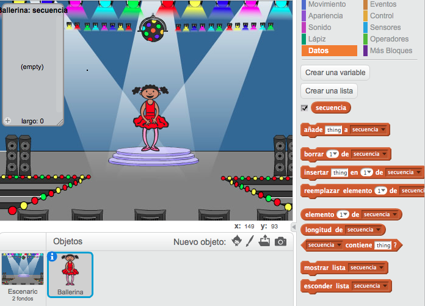
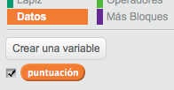
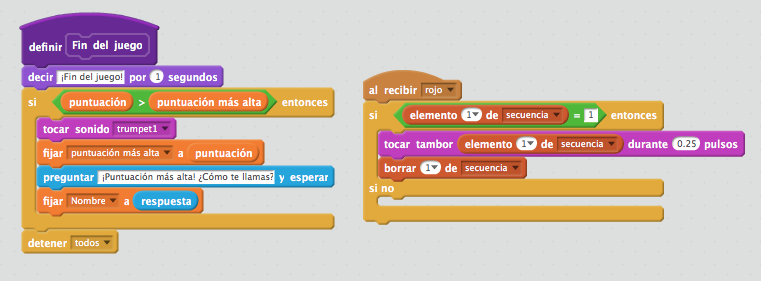

# Introducción { .intro }

En este proyecto, ¡vas a crear un juego de memoria en el que tendrás que memorizar y repetir una secuencia de colores aleatoria!

<div class="scratch-preview">
  <iframe allowtransparency="true" width="485" height="402" src="https://scratch.mit.edu/projects/embed/34874510/?autostart=false" frameborder="0"></iframe>
  
</div>

# Paso 1: Colores al azar { .activity }

Para empezar, vamos a crear un personaje que pueda cambiar a una secuencia de colores al azar que el jugador tendrá que memorizar.

## Lista de tareas de la actividad { .check }

+ Crea un nuevo proyecto de Scratch, y borra el objeto gato para que el proyecto esté vacío. Puedes encontrar el editor online de Scratch en <a href="http://jumpto.cc/scratch-new">jumpto.cc/scratch-new</a>.

+ Escoge un personaje y un fondo. No es necesario que tu personaje sea una persona, pero tiene que poder cambiar de color.

	

+ En el juego, usarás un número diferente para representar cada color:

	+ 1 = rojo;
	+ 2 = azul;
	+ 3 = verde;
	+ 4 = amarillo.

	Da a tu personaje disfraces de 4 colores diferentes. Los colores tendrán que ser los indicados arriba. Asegúrate de que los colores de los disfraces están en el orden correcto.

	

+ Para crear una secuencia aleatoria, tendrás que crear una __lista__. Una lista es simplemente una variable que almacena una gran cantidad de datos __en orden__. Crea una nueva lista llamada `secuencia` {.blockdata}. Como tu personaje es el único que necesita ver esta lista, también podemos seleccionar 'Sólo para este objeto'.

	

	A continuación, deberías ver una lista vacía en la parte superior izquierda del escenario, y un montón de bloques nuevos para usar listas.

	

+ Añade este código a tu personaje para añadir un número al azar a tu lista (y mostrar el disfraz correcto) 5 veces:

	```blocks
		al presionar bandera verde
		borrar (todos v) de [secuencia v]
		repetir (5)
			añade (número al azar entre (1) y (4)) a [secuencia v]
			cambiar disfraz a (elemento (último v) de [secuencia v])
			esperar (1) segundos
		fin
	```

	Fíjate que has vaciado la lista para empezar.

## Reto: Añadir sonido {.challenge}
Haz varias pruebas con tu proyecto. Verás que a veces sale el mismo número dos (o más) veces seguidas. Esto hará que la secuencia sea más difícil de memorizar. ¿Puedes hacer que suene el tambor cada vez que cambia el disfraz del personaje?

¿Puedes hacer que suene un sonido diferente del tambor en función del número al azar escogido? Esto es _muy_ parecido al código para cambiar el disfraz del personaje.

## Guarda el Proyecto { .save }

# Paso 2: Repite la secuencia { .activity }

Vamos a añadir 4 botones para que el jugador pueda repetir la secuencia a recordar.

## Lista de tareas de la actividad { .check }

+ Añade 4 objetos al proyecto, que se convertirán en botones. Edita los 4 objetos para que haya 1 para cada uno de los 4 colores.

	

+ Al presionar el tambor rojo, tendrás que enviar un mensaje a tu personaje, diciéndole que se ha presionado el botón rojo. Añade este código al tambor rojo:

	```blocks
		al hacer clic en este objeto
		enviar [rojo v]
	```

+ Cuando tu personaje reciba este mensaje, tendrá que comprobar si el número 1 es el primero de la lista (esto significa que el rojo es el siguiente color en la secuencia). Si lo es, puedes eliminar el número de la lista, ya que el jugador ha acertado el color. Si no lo es, ¡se acabó el juego!.

	```blocks
		al recibir [rojo v]
		si <(elemento (1 v) de [secuencia v]) = [1]> entonces
   			borrar (1 v) de [secuencia v]
		si no
			decir [¡Fin del juego!] por (1) segundos
			detener [todos v]
		fin
	```

+ También podrías hacer que parpadeen luces cuando se haya vaciado la lista, ya que esto significa que el jugador ha acertado la secuencia entera. Añade este código al final del programa `al presionar bandera verde` {.blockevents} de tu personaje:

	```blocks
		esperar hasta que <(longitud de [secuencia v]) = [0]>
		enviar [victoria v] y esperar
	```

+ Haz clic en el escenario y añade este código para que el fondo cambie de color cuando el jugador gane.

	```blocks
		al recibir [victoria v]
		tocar sonido [drum machine v]
		repetir (50)
			cambiar efecto [color v] por (25)
			esperar (0.1) segundos
		fin
		quitar efectos gráficos
	```

## Reto: Crear 4 botones {.challenge}
Repite los pasos indicados arriba para los botones de color azul, verde y amarillo. ¿Qué código se quedará igual, y qué código tendrás que cambiar para cada botón?

También puedes hacer que se oigan sonidos al presionar los botones.

¡Recuerda probar el código que has añadido! ¿Puedes memorizar una secuencia de 5 colores? ¿Es la secuencia diferente cada vez?

## Guarda el proyecto { .save }

# Paso 3: Niveles múltiples { .activity .new-page }

Hasta ahora, el jugador sólo tiene que memorizar 5 colores. Vamos a mejorar el juego, haciendo que la secuencia sea más larga.

## Lista de tareas de la actividad { .check }

+ Crea una nueva variable con el nombre `puntuación` {.blockdata}.

	

+ Esta `puntuación` {.blockdata} se usará para decidir la duración de la secuencia que el jugador tiene que memorizar. Para empezar, la puntuación (y la duración de la secuencia) es 3. Añade el siguiente bloque al principio del código `al presionar bandera verde` {.blockevents} de tu personaje:

	```blocks
		fijar [puntuación v] a [3]
	```

+ Ahora, en lugar de crear una secuencia de 5 colores, haremos que la `puntuación` {.blockdata} determine la duración de la secuencia. Cambia el bucle `repetir` {.blockcontrol} (para crear la secuencia) a:

	```blocks
		repetir (puntuación)
		fin
	```

+ Si el jugador acierta la secuencia, deberías añadir 1 a la puntuación para aumentar la duración de la secuencia.

	```blocks
		cambiar [puntuación v] por (1)
	```

+ Para acabar, tienes que añadir un bucle `por siempre` {.blockcontrol} alrededor del código para generar la secuencia, y así se creará una nueva secuencia para cada nivel. El código de tu personaje debería ser así:

	```blocks
		al presionar bandera verde
		fijar [puntuación v] a [3]
		por siempre
   			borrar (todos v) de [secuencia v]
			repetir (puntuación)
				añade (número al azar entre (1) y (4)) a [secuencia v]
				cambiar disfraz a (elemento (último v) de [secuencia v])
				esperar (1) segundos
			fin
			esperar hasta que <(longitud de [secuencia v]) = [0]>
			enviar [victoria v] y esperar
			cambiar [puntuación v] por (1)
		fin
	```

+ Haz que tus amigos prueben el juego. ¡Recuerda esconder la lista `secuencia` {.blockdata} antes de que jueguen!

## Guarda tu proyecto { .save }

# Paso 4: Puntuación más alta { .activity }

Vamos a hacer que se guarde la puntuación más alta, para que puedas competir con tus amigos.

## Lista de tareas de la actividad  { .check }

+ Añade 2 nuevas variables a tu proyecto con los nombres `puntuación más alta` {.blockdata} y `nombre` {.blockdata}.

+ Si se acaba el juego (al presionar el botón equivocado), tendrás que comprobar si la puntuación del jugador es mayor que la puntuación más alta actual. Si lo es, tienes que guardar esa puntuación como la puntuación más alta y hacer que se guarde el nombre del jugador. El botón rojo debería ser así:

	```blocks
		al recibir [rojo v]
		si <(elemento (1 v) de [secuencia v]) = [1]> entonces
			borrar (1 v) de [secuencia v]
		si no
			decir [¡Fin del juego!] por (1) segundos
			si <(puntuación) > (puntuación más alta)> entonces
				fijar [puntuación más alta v] a (puntuación)
				preguntar [¡Puntuación más alta! ¿Cómo te llamas?] y esperar
				fijar [nombre v] a (respuesta)
			fin
			detener [todos v]
		fin
	```

+ ¡Tendrás que añadir este nuevo código a los otros 3 botones también! ¿Te has dado cuenta de que el código de 'Fin del Juego' en los 4 botones es exactamente el mismo?

	

+ Si alguna vez tuvieras que cambiar algo de este código, como añadir un sonido o cambiar el mensaje de '¡Fin del Juego!', ¡tendrías que cambiarlo 4 veces! Eso sería muy pesado y te llevaría mucho tiempo.

	En lugar de hacer eso, ¡puedes definir tus propios bloques y reusarlos en tu proyecto! Para hacer esto, presiona `más bloques` {.blockmoreblocks}, y a continuación 'Crear un bloque'. Llama a este nuevo bloque 'Fin del Juego'.

	

+ Añade el código del bloque `si no` {.blockcontrol} del botón rojo al nuevo bloque que aparece:

	

+ Acabas de crear una nueva _función_ llamada `Fin del Juego` {.blockmoreblocks}, que podrás usar siempre que quieras. Arrastra tu nuevo bloque de `Fin del Juego` {.blockmoreblocks} hasta los 4 programas de los botones.

	

+ Ahora añade un sonido para cuando el jugador aprieta el botón equivocado. ¡Sólo tienes que añadir este código _una vez_ en el bloque de `Fin del Juego` {.blockmoreblocks} que has creado, en lugar de 4 veces!

	

## Reto: Crear más bloques {.challenge}
¿Puedes encontrar otro código que sea el mismo para los 4 botones?


¿Puedes crear otro bloque personalizado, que se pueda usar en todos los botones?

## Guarda tu proyecto { .save }

## Reto: Otro disfraz {.challenge}
¿Te has dado cuenta de que el juego empieza con el personaje vestido con uno de los 4 colores, y que siempre muestra el último color de la secuencia mientras el jugador repite la secuencia?

¿Puedes añadir otro disfraz de color blanco para el personaje, que aparecerá al principio del juego y cuando el jugador está intentando copiar la secuencia?


## Guarda el proyecto { .save }

## Reto: Nivel de dificultad {.challenge}
¿Puedes hacer que el jugador pueda escoger entre 'modo fácil' (usando sólo los tambores rojo y azul) y 'modo normal' (usando los 4 tambores)?

Incluso podrías añadir un modo 'difícil', ¡en el que se use un quinto tambor!

## Guarda tu proyecto { .save }

## Community Contributed Translation { .challenge .pdf-hidden }

This project was translated by Montse Verdaguer. Our amazing translation volunteers help us give children around the world the chance to learn to code.  You can help us reach more children by translating a Code Club project via [Github](https://github.com/CodeClub/curriculum_documentation/blob/master/contributing.md) or by getting in touch with us at hello@codeclubworld.
