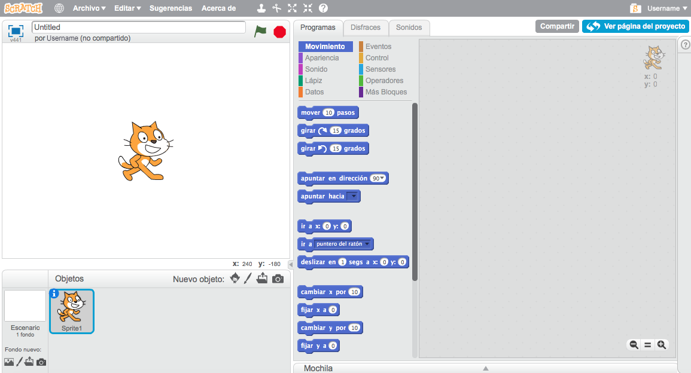
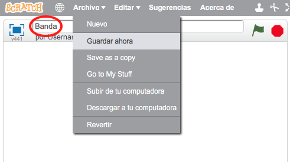
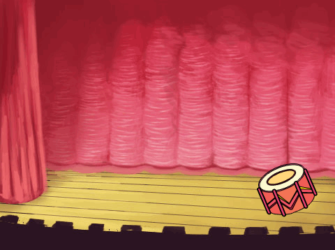
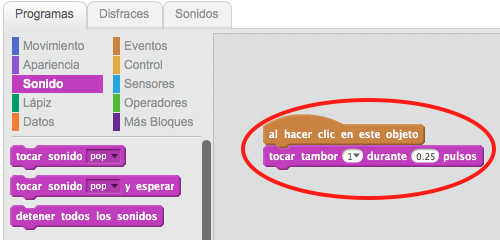
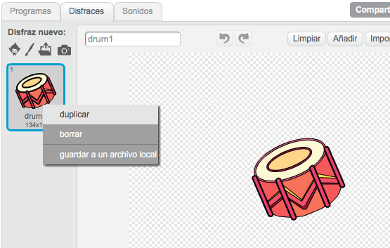
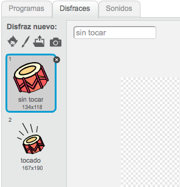
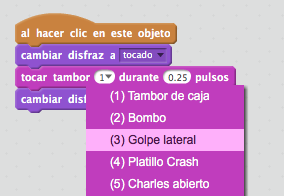
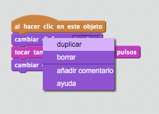
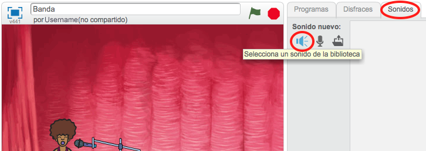

# Introducción { .intro }

¡En este Proyecto aprenderás cómo codificar tus propios instrumentos musicales!

<div class="scratch-preview">
  <iframe allowtransparency="true" width="485" height="402" src="https://scratch.mit.edu/projects/embed/26741186/?autostart=false" frameborder="0"></iframe>
  
</div>

# Paso 1: Objetos { .activity }

Para poder empezar a animar, necesitas añadir una “cosa” que animar. En Scratch, estas “cosas” se llaman __objetos__.

## Lista de tareas de la actividad { .check }

+ Para empezar, abre el editor de Scratch. Puedes encontrar el editor en línea de Scratch editor en <a href="http://jumpto.cc/scratch-new">jumpto.cc/scratch-new</a>. Éste es su aspecto:

	

+ El objeto gato que ves es la mascota de Scratch. Deshagámosnos de él haciendo clic en el botón derecho y luego haciendo clic en “borrar”.

	

+ Luego, haz clic en “Selecciona un objeto de la biblioteca” para abrir una lista con todos los objetos de Scratch.

	

+ Baja hasta encontrar el objeto de un tambor. Selecciona un tambor, y haz clic en “OK” para añadirlo a tu proyecto.

	

+ Haz clic en el icono “encoger”, y luego haz clic en el tambor unas cuantas veces para hacerlo más pequeño.

	

## Guarda tu proyecto { .save }

Dale un nombre a tu proyecto escribiéndolo en la casilla de texto de la parte superior del escenario.

Después puedes hacer clic en “Archivo” y “Guardar ahora” para guardar tu proyecto.



# Paso 2: El Escenario { .activity }

El __escenario__ es el área que se encuentra a la izquierda, y es donde tu proyecto cobra vida. Imagínate que es el área donde se hace la presentación, ¡como en un escenario real!

## Lista de tareas de la actividad { .check }

+ ¡En estos momentos, el escenario es de color blanco y parece bastante aburrido! Vamos a añadir un fondo al escenario haciendo clic en “Selecciona un fondo de la biblioteca”.

	

+ Haz clic en “Interiores” en la parte izquierda, selecciona un fondo de escenario y luego haz clic en “OK”.

	

+ Ahora tu escenario debería de parecerse a éste:

	

# Paso 3: Crear un tambor { .activity }

Vamos a codificar tu tambor para que suene cuando lo toquemos.

## Lista de tareas de la actividad { .check }

+ Puedes encontrar los bloques de código en la pestaña “Programas” ¡y todas tienen códigos de color!

	Haz clic en el objeto tambor y luego arrastra estos 2 bloques al área de código de la derecha, asegurándote de que estén conectados juntos (como los bloques de lego):

	

+ ¡Haz clic en el tambor para probar tu nuevo instrumento!

+ También puedes cambiar el aspecto de tu tambor cuando le hacen clic, creando un nuevo disfraz. Haz clic en la pestaña “Disfraces”, y verás la imagen del tambor.

	

+ Haz clic con el botón derecho en el disfraz y selecciona “duplicar” para crear una copia del disfraz.

	

+ Haz clic en el nuevo disfraz (que se llama “tambor 2”), selecciona la herramienta de línea y dibuja líneas para que parezca que el tambor está haciendo sonidos.

	

+ En este momento los nombres de los disfraces no son muy útiles. Renombra los 2 disfraces a “sin tocar” y “tocado” escribiendo el nuevo nombre para cada disfraz en el cuadro de texto.

	

+ ¡Ahora que ya tienes 2 disfraces diferentes para tu tambor, puedes elegir qué disfraz mostrar! Añade estos 2 bloques a tu tambor:

	

	El bloque de código para cambiar el disfraz está en la sección “Apariencia” {.blocklooks}.

+ Prueba tu tambor. ¡Cuando haces clic en el tambor, debería parecer que está siendo tocado!

## Guarda tu proyecto { .save }

##Desafío: Mejorar tu tambor { .challenge }

+ ¿Puedes cambiar el sonido que hace tu tambor cuando haces clic en él?



+ ¿Puedes hacer también que el tambor haga un sonido cuando se presiona la barra espaciadora? Necesitarás utilizar este bloque “Eventos” {.blockevents}:

```blocks
	al presionar tecla [espacio v]
```

Puedes copiar el código existente haciendo clic en el código con el botón derecho y seleccionando “duplicar”.



## Guarda tu proyecto { .save }

# Paso 4: Crear un cantante { .activity .new-page }

¡Vamos a añadir un cantante a tu banda!

## Lista de tareas de la actividad { .check }

+ Añade otros 2 objetos a tu escenario; un cantante y un micrófono.

	

+ Para hacer que tu cantante cante, necesitarás añadir un sonido a tu objeto. Asegúrate de haber seleccionado al cantante, haz clic en la pestaña “Sonidos” y haz clic en “Selecciona un sonido de la biblioteca”:

	

+ Si haces clic en “Canto” en el lado izquierdo, podrás elegir un sonido adecuado para añadir a tu objeto.

	

+ Ahora que has añadido el sonido, puedes añadir este código a tu cantante:

	```blocks
		al hacer clic en este objeto
		Tocar sonido [singer1 v] y esperar
	```

+ Prueba tu cantante, para asegurarte de que cante cuando le haces clic.

## Guarda tu proyecto { .save }

##Desafío: Cambiar el disfraz de tu cantante { .challenge }
¿Puedes hacer que parezca que tu cantante está cantando cuando le haces clic? Si necesitas ayuda, puedes usar las instrucciones anteriores para crear un tambor.


¡No olvides probar que tu nuevo código funciona!

## Guarda tu proyecto { .save }

##Desafío: Crear tu propia banda { .challenge }
¡Usa lo que has aprendido en este proyecto para crear tu propia banda! Puedes crear el instrumento que quieras, pero fíjate en los sonidos disponibles y en los instrumentos para tener algunas ideas.


Pero tus instrumentos no tienen por qué ser lógicos. Por ejemplo, puedes crear un piano hecho de muffins!


Puedes usar los objetos existentes y también dibujar los tuyos propios.


¡Si tienes un micrófono puedes grabar tus propios sonidos, o incluso usar una cámara web para tocar los instrumentos!


## Guarda tu proyecto { .save }

## Community Contributed Translation { .challenge .pdf-hidden }

This project was translated by María Alejandra Aguada from Translators Without Borders. Screenshots in Spanish were provided by Montse Verdaguer. Our amazing translation volunteers help us give children around the world the chance to learn to code.  You can help us reach more children by translating a Code Club project via [Github](https://github.com/CodeClub/curriculum_documentation/blob/master/contributing.md) or by getting in touch with us at hello@codeclubworld.
