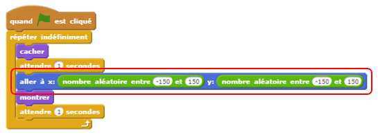

# Introduction { .intro }

Vous allez créer un jeu pour attraper des fantômes!

<div class="scratch-preview">
  <iframe allowtransparency="true" width="485" height="402" src="https://scratch.mit.edu/projects/embed/172595411/?autostart=false" frameborder="0"></iframe>
  
</div>

# Étape 1: Animer un fantôme { .activity }

## Liste de contrôle d'activité { .check }

+ Démarrez un nouveau projet de Scratch et supprimez le lutin de chat pour que votre projet soit vide. Vous pouvez trouver l'éditeur scratch en ligne à <a href="http://jumpto.cc/scratch-new" target="_blank">jumpto.cc/scratch-new</a>.

+ Ajoutez un nouveau lutin de fantôme et un arrière-plan approprié.

	

+ Ajoutez ce code au fantôme pour qu'il apparaisse et disparaisse constamment :

	```blocks
    	quand le drapeau vert pressé
    	répéter indéfiniment
       		cacher
       		attendre (1) secondes
       		montrer
       		attendre (1) secondes
    	fin
	```

+ Testez le code de votre fantôme en appuyant sur le drapeau vert.

## Sauvegarder votre projet { .save }

# Étape 2: Fantômes aléatoires { .activity }

Votre fantôme est trop facile à attraper parce qu'il ne bouge pas!

## Liste de contrôle d'activité { .check }

+ Au lieu de rester au même endroit, Scratch peut choisir les coordonnées x et y de façon aléatoire. Ajouter un bloc `aller à` {.blockmotion} au code du fantôme pour que ça ressemble à ceci :

	

+ Testez votre fantôme de nouveau et vous devriez remarquer qu'il apparaît dans un endroit différent à chaque fois.

## Sauvegarder votre projet { .save }

## Défi: Plus aléatoire {.challenge}
Pouvez-vous faire `attendre` {.blockcontrol} votre fantôme pendant une durée de temps aléatoire avant de réapparaître?  Pouvez-vous utiliser le bloc `mettre à (  ) % de la taille initiale` {.blocklooks} pour donner une taille aléatoire à votre fantôme à chaque fois qu'il apparaît?

## Sauvegarder votre projet { .save }

# Étape 3: Attraper des fantômes { .activity }

Donnons la possibilité au joueur d'attraper les fantômes!

## Liste de contrôle d'activité { .check }

+ Pour permettre au joueur d'attraper un fantôme, ajoutez ce code :

	```blocks
    quand ce lutin est cliqué
    cacher
	```

+ Testez votre projet. Pouvez-vous attraper les fantômes lorsqu'ils apparaissent? Si vous avez du mal à les attraper, vous pouvez jouer avec un plein écran en cliquant sur le bouton suivant :

	

## Défi: Ajouter du son { .challenge }
Pouvez-vous ajouter un bruit à chaque fois qu'un fantôme est attrapé?

## Sauvegarder votre projet { .save }

# Étape 4: Ajouter le pointage { .activity .new-page }

Rendons les choses plus intéressantes en gardant le compte du pointage.

## Liste de contrôle d'activité { .check }

+ Pour garder le compte du pointage du joueur, il faut le stocker quelque part. Une __variable__ est un endroit pour garder des données qui peuvent changer, comme un pointage.

	Pour créer une variable, cliquez sur l'onglet 'Scripts', sélectionnez `Données` {.blockdata}, puis cliquez sur 'Créer une variable'.

	

	Tapez 'pointage' comme nom de variable, vérifiez que la variable est disponible pour tous les lutins et cliquez sur 'OK' pour créer la variable. Vous allez ensuite voir plusieurs blocs de code qui peuvent être utilisés avec votre variable `pointage` {.blockdata}.

	

	Vous allez aussi voir le pointage en haut à gauche de la scène.

	

+ Lorsque vous commencez un nouveau jeu (en cliquant sur le drapeau), vous devez remettre le pointage à 0 :

	```blocks
    quand ⚑ cliqué
    [pointage v] prend la valeur [0]
	```

+ Vous devrez ajouter 1 au pointage à chaque fois qu'un fantôme sera attrapé :

	

+ Exécutez votre programme de nouveau et attrapez quelques fantômes. Votre pointage change-t-il?

## Sauvegarder votre projet { .save }

# Étape 5: Ajouter un compte à rebours { .activity }

Vous pouvez rendre votre jeu encore plus intéressant en limitant chaque partie à 10 secondes pour attraper le plus de fantômes possible.

## Liste de contrôle d'activité { .check }

+ Vous pouvez utiliser une autre variable pour stocker le temps qu'il vous reste. Cliquez sur la scène et créez une nouvelle variable nommée 'temps' :

	

+ Le compte à rebours devrait fonctionner ainsi :

	+ Le compte à rebours devrait commencer à 10 secondes ;
	+ Le compte à rebours devrait décompter chaque seconde ;
	+ Le jeu devrait s'arrêter lorsque le compte à rebours arrive à 0.

	Voici le code qui vous permettra de réaliser cela. Vous pouvez ajouter celui-ci à votre __scène__ :

	```blocks
    	quand le drapeau vert pressé
    	[temps v] prend la valeur [10]
    	répéter jusqu’à <(temps) = [0]>
       		attendre (1) secondes
       		ajouter à [temps v] (-1)
    	fin
    	stop [tout v]
	```

	Voici comment vous pouvez ajouter le code `répéter jusqu’à`{.blockcontrol}`temps`{.blockdata}`= 0`{.blockoperators} :

	

+ Déplacez votre variable 'temps' vers le côté droit de votre scène. Vous pouvez aussi faire un clic droit sur l'affichage de la variable et choisir 'grande lecture' afin de changer la présentation du temps.

	

+ Demandez à un ami de tester votre jeu. Combien de points peut-il marquer? Si votre jeu est trop facile, vous pouvez :

	+ Donner moins de temps au joueur ;
	+ Faire en sorte que les fantômes apparaissent moins souvent ;
	+ Réduire la taille des fantômes.

	Testez votre jeu à quelques reprises jusqu'à ce que vous soyez satisfaits du niveau de difficulté.

## Sauvegarder votre projet { .save }

## Défi: Plus d'objets {.challenge}
Pouvez-vous ajouter d'autres objets à votre jeu?


Vous devrez penser aux objets que vous allez ajouter. Pensez à ces questions :

+ Quelle sera sa taille?
+ Apparaîtra-t-il plus ou moins souvent que les fantômes?
+ À quoi correspond-il au niveau de l'image et du son lorsqu'on l'attrape?
+ Combien de points devrait-on gagner (ou perdre) lorsqu'on l'attrape?

Si vous avez besoin d'aide pour ajouter un autre objet, vous pouvez suivre de nouveau les étapes ci-dessus!

## Sauvegarder votre projet { .save }
