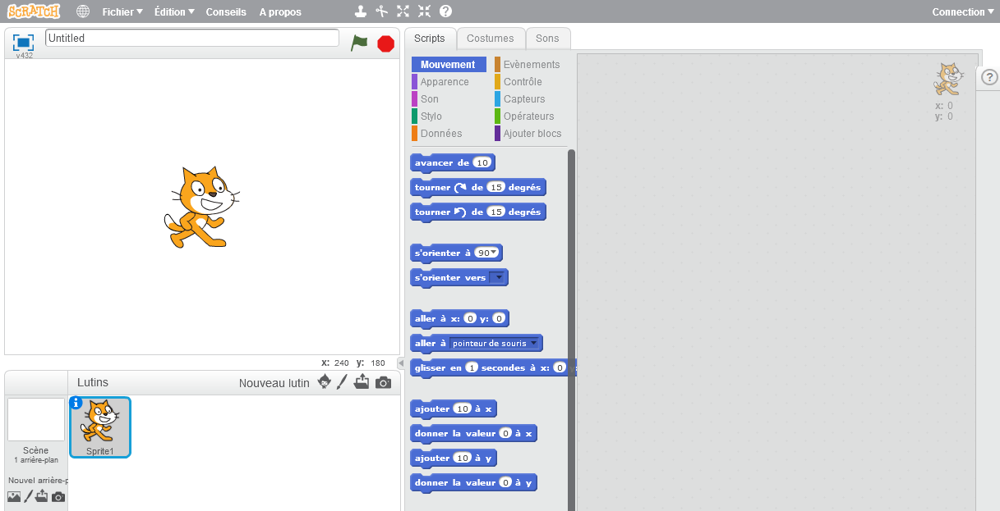
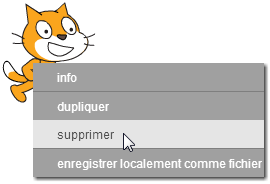
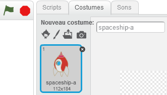
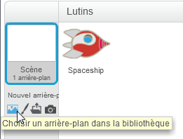
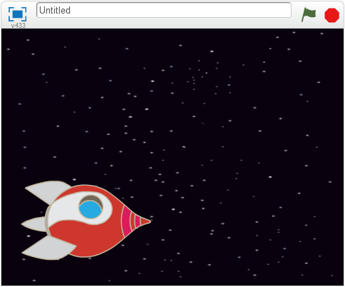
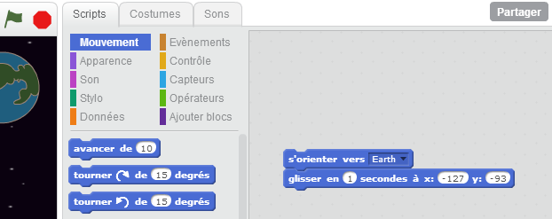
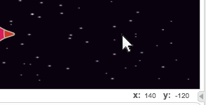
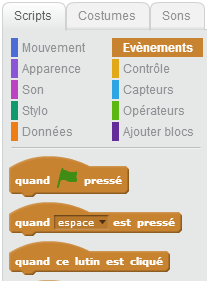
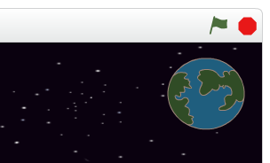

# Introduction { .intro }

Vous allez apprendre à programmer votre propre animation !

<div class="scratch-preview">
 <iframe allowtransparency="true" width="485" height="402" src="https://scratch.mit.edu/projects/embed/26818098/?autostart=true" frameborder="0"></iframe>
 
</div>

# Étape 1 : Les lutins { .activity }

## Liste d'activités { .check }

+ Tout d'abord, assurez-vous d'avoir ouvert l'éditeur Scratch. Vous pouvez le trouver en ligne à l'adresse <a href="http://jumpto.cc/scratch-new">jumpto.cc/scratch-new</a>. Il devrait ressembler à ceci :

	

+ Avant de pouvoir coder votre animation, il vous faut un 'objet' à animer. Dans Scratch, ces 'objets' sont appelés 'lutins'. Le chat que vous pouvez voir est un lutin nommé Félix. C'est la mascotte de Scratch, mais débarrassons-nous de lui pour l'instant. Cliquez sur Felix avec le bouton droit de la souris, puis choisissez 'supprimer'.

	

+ Cliquez ensuite sur l'icône 'Choisir un lutin dans la bibliothèque' pour voir tous les lutins qui sont fournis avec Scratch.

	

+ Faites défiler les images jusqu'à ce que vous trouviez un vaisseau spatial. Cliquez dessus pour le sélectionner, puis cliquez sur 'OK' pour l'ajouter à votre animation.

	

+ Cliquez sur votre nouveau vaisseau spatial dans la zone 'Lutins' en bas à gauche, puis allez dans l'onglet 'Costumes' à droite.

	

+ Utilisez l'outil flèche pour sélectionner toute l'image. Puis cliquez et tirez sur la poignée de rotation pour faire tourner la fusée sur ​​le côté.

	

+ Vous devriez maintenant avoir un grand vaisseau spatial sur votre 'scène'. La 'scène' est la zone en haut à gauche. C'est là que votre animation va se dérouler, c'est comme une vraie scène de théatre ! Vous pouvez faire glisser le vaisseau spatial autour de la scène pour le déplacer.

	Pour l'instant, votre scène est blanche et bien ennuyeuse ! Ajoutez-y une toile de fond : Allez dans l'onglet​ 'Arrière-plans' de la scène, puis cliquez sur l'icône 'Choisir un arrière-plan dans la bibliothèque'.

	

+ Cliquez sur la catégorie 'Espace' à gauche, puis choisissez l'arrière-plan étoilé qui s'appelle 'stars'. Cliquez sur 'OK' pour l'ajouter à votre scène.

	

	Votre scène devrait maintenant ressembler à cela :

	

## Défi : Ajoutez un autre lutin { .challenge }
Pouvez-vous ajouter un nouveau lutin (la Terre) à votre scène, pour que ça ressemble à ceci ?


## Enregistrez votre projet { .save }

Pour ne pas perdre votre travail, vous devez l'enregistrer régulièrement. Tout d'abord, donnez un nom à votre animation : tapez-le dans la zone texte au dessus de la scène. Vous pouvez ensuite cliquer sur 'Fichier' puis 'Sauvegarder maintenant' pour enregistrer votre projet.


Si vous utilisez Scratch en ligne, tout ce que vous sauvegardez est ajouté à vos 'projets'. C'est un dossier en ligne auquel vous pouvez accéder de n'importe où, même de chez vous. Vous pouvez accéder à ce dossier en cliquant sur 'Fichier', puis 'Aller à mes projets'.


Ceci vous donne la liste de tous vous projets. Cliquez sur 'Voir à l'intérieur' pour continuer de programmer votre animation.

Si vous utilisez Scratch en ligne mais que vous n'avez pas de nom d'utilisateur, vous pouvez cliquer sur 'Télécharger dans votre ordinateur' pour sauvegarder votre projet sur votre ordinateur.

# Étape 2 : Animez vos lutins { .activity }

Maintenant que vous avez quelques lutins, nous allons ajouter du code pour les animer !

## Liste d'activités { .check }

+ Créons un script pour le vaisseau spatial, en utilisant des blocs de code. Vous pouvez trouver ces blocs dans l'onglet 'Scripts'. Ils ont tous un code de couleur ! Faites glisser les 2 blocs suivants dans la zone de code à droite, en vous assurant qu'ils sont bien attachés ensemble (comme des blocs Lego).

	

	Modifiez les chiffres dans les blocs de code, de façon à ce que le code soit exactement le même que dans l'image ci-dessus. Voici le code que vous devez ajouter :


	```blocks
		s'orienter vers [Earth v]
		glisser en (1) secondes à x:(0) y:(0)
	```

	Pour coder `s'orienter vers Earth` {.blockmotion}, vous devez d'abord glisser et déposer le bloc de code, puis cliquer sur la petite flèche vers le bas pour choisir le lutin 'Earth'.

	

+ Si vous cliquez sur ces blocs, le code sera exécuté : Vous devriez voir le vaisseau spatial tourner et se déplacer vers le centre de la scène.

	

	La position sur l'écran `x:(0) y:(0)` {.blockmotion} est le centre de la scène. Une position comme `x:(-150) y:(-150)` {.blockmotion} est située presque tout en bas et à gauche de la scène. Et une position comme `x:(150) y:(150)` {.blockmotion} est près du haut droit de la scène.

	

	Si vous voulez connaître les coordonnées d'un endroit sur la scène, mettez la souris à la position souhaitée, puis notez les coordonnées qui sont affichées sous la scène.

	

+ Si vous essayez de cliquer à nouveau sur le code pour l'exécuter une seconde fois, rien ne se passe ! C'est parce que le vaisseau est déjà arrivé là où on lui a dit d'aller. Améliorons votre animation : Demandons au vaisseau de toujours commencer en bas à gauche de la scène, et faisons-le pointer vers le haut.

+ Ajoutez quelques blocs à votre animation, devant les blocs que vous avez déjà. Votre code devrait maintenant ressembler à ceci :

	```blocks
		s'orienter à (0 v)
		aller à x:(-150) y:(-150)
		attendre (1) secondes
		s'orienter vers [Earth v]
		glisser en (1) secondes à x:(0) y:(0)
	```

	Vous trouverez le bloc `attendre (1) secondes` {.blockcontrol} en cliquant sur la section orange `Contrôle` {.blockcontrol}.

+ Votre vaisseau spatial se déplace maintenant _chaque fois_ que vous exécutez votre code. Essayez-le !

+ Vous pouvez également attacher vos blocs de code à un 'événement'. Cela signifie que le code s'exécutera lorsque quelque chose se passera : par exemple lorsque vous cliquez sur le drapeau vert, lorsque vous appuyez sur une touche ou lorsque vous cliquez sur un lutin.

	

	Faites glisser un événement au tout début de votre code, pour que l'animation démarre lorsque vous cliquez sur le drapeau vert. Votre code devrait ressembler à ceci:


	```blocks
		quand le drapeau vert pressé
		s'orienter à (0 v)
		aller à x:(-150) y:(-150)
		attendre (1) secondes
		s'orienter vers [Earth v]
		glisser en (1) secondes à x:(0) y:(0)
	```

+ Essayez votre animation à plusieurs reprises, en cliquant sur le drapeau vert juste au-dessus de la scène.

	

## Défi : Améliorez votre animation {.challenge}
Pouvez-vous modifier les chiffres dans le code de votre animation, pour que :
+ Le vaisseau spatial se déplace jusqu'à ce qu'il touche la Terre ?
+ Le vaisseau spatial se déplace plus lentement vers la Terre ?

Vous devrez changer les chiffres de ce bloc :

```blocks
	glisser en (1) secondes à x:(0) y:(0)
```

## Enregistrez votre projet { .save }

# Étape 3 : Animez à l'aide de boucles { .activity }

## Liste d'activités { .check }

+ Une autre façon d'animer le vaisseau spatial est de le déplacer un tout petit peu (disons de 4 pas) mais de nombreuses fois. Supprimez le bloc `glisser` {.blockmotion} de votre code, par un clic droit sur ​​le bloc puis 'supprimer'. Vous pouvez aussi supprimer le code en le faisant glisser hors de la zone de code à droite, et en le remettant dans la zone des blocs au milieu.

+ Une fois que vous avez retiré ce bloc, ajoutez le code suivant à sa place :

	```blocks
		quand le drapeau vert pressé
		s'orienter à (0 v)
		aller à x:(-150) y:(-150)
		attendre (1) secondes
		s'orienter vers [Earth v]
		répéter (100) fois
		   avancer de (4)
	```

+ Le bloc `répéter (100) fois` {.blockcontrol} est utilisé pour répéter quelque chose plusieurs fois. On appelle ça une 'boucle'. Si vous cliquez sur le drapeau pour essayer ce nouveau code, vous verrez qu'il fait à peu près la même chose qu'avant.

+ L'utilisation d'une boucle pour déplacer le vaisseau spatial, vous permet d'ajouter plus de code à l'intérieur du bloc `répéter` {.blockcontrol} pour faire des choses intéressantes. Si vous ajoutez le bloc `ajouter à l'effet couleur (25)` {.blocklooks} (qui est dans la section 'Apparence') dans la boucle, vous verrez la couleur du vaisseau spatial changer pendant qu'il se déplace :

	```blocks
		quand le drapeau vert pressé
		s'orienter à (0 v)
		aller à x:(-150) y:(-150)
		attendre (1) secondes
		s'orienter vers [Earth v]
		répéter (100) fois
		   avancer de (4)
		   ajouter à l'effet [couleur v] (25)
	```

+ Cliquez sur le drapeau pour voir votre nouvelle animation.

+ Vous pouvez aussi améliorer votre animation en disant au vaisseau spatial de devenir plus petit lorsqu'il se déplace vers la Terre. N'oubliez pas d'ajouter également du code au début de l'animation, pour que votre vaisseau spatial démarre avec sa taille originale.

	```blocks
		quand le drapeau vert pressé
		mettre à (100) de la taille initiale
		s'orienter à (0 v)
		aller à x:(-150) y:(-150)
		attendre (1) secondes
		s'orienter vers [Earth v]
		répéter (100) fois
		   avancer de (4)
		   ajouter à l'effet [couleur v] (25)
		   ajouter (-1) à la taille
	```

+ Si vous essayez votre animation maintenant, vous verrez que c'est bien mieux qu'avant !

## Enregistrez votre projet { .save }

# Étape 4 : Plus de boucles { .activity }

## Liste d'activités { .check }

+ Ajoutons maintenant un singe, perdu dans l'espace, à l'animation ! Commencez par choisir un lutin singe dans la bibliothèque.

	

+ Si vous cliquez sur votre nouveau lutin singe, puis sur l'onglet 'Costumes', vous pouvez modifier l'apparence de votre singe. Cliquez sur l'outil cercle (nommé ici 'Ellipse') et dessinez un casque blanc autour de la tête du singe.

	

+ Maintenant, cliquez sur l'onglet 'Scripts' et ajoutez du code pour que le singe tourne lentement et indéfiniment en rond :

	```blocks
		quand le drapeau vert pressé
		répéter indéfiniment
		   tourner droite de (1) degrés
	```

	

	Le bloc `répéter indéfiniment` {.blockcontrol} est une boucle qui se répète sans fin. Vous devrez l'arrêter en cliquant sur le bouton 'stop' rouge à côté du drapeau vert.

+ Vous pouvez également combiner des boucles. Ajoutez un lutin 'étoile' à votre animation, et programmez-le comme ceci :

	```blocks
		quand le drapeau vert pressé
		répéter indéfiniment
			répéter (20) fois
				ajouter (2) à la taille
			end
			répéter (20) fois
				ajouter (-2) à la taille
			end
	```

	

+ Cliquez sur le drapeau pour tester l'animation de votre étoile. Que fait ce code ? Il fait légèrement grossir l'étoile 20 fois, puis rétrécir 20 fois pour revenir à sa taille du début. Et pour que cette animation recommence tout le temps, nous mettons ces deux boucles dans une troisième boucle `répéter indéfiniment`{.blockcontrol}.

## Enregistrez votre projet { .save }

## Défi : Créez votre propre animation {.challenge}
Arrêtez votre animation de l'espace, et cliquez sur 'Fichier' puis 'Nouveau', pour démarrer un nouveau projet. Utilisez ce que vous avez appris dans ce projet pour faire votre propre animation. Vous pouvez faire ce que vous voulez, mais essayez de rester dans le cadre défini. Voici quelques exemples :


## Enregistrez votre projet { .save }

Bravo ! Vous avez maintenant terminé votre premier projet Scratch. Si vous utilisez l'éditeur en ligne, vous pouvez permettre aux autres de voir votre animation en cliquant sur 'Partager' en haut à droite de l'éditeur Scratch !


