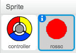
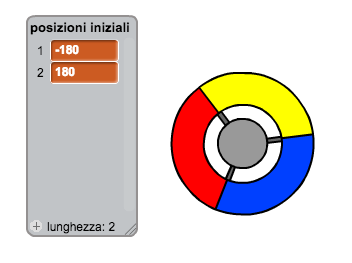

# Introduzione {.intro}

In questo progetto, i bambini impareranno a creare un gioco in cui il giocatore dovrà accoppiare i puntini colorati con le parti corrispondenti del controller.

<div class="scratch-preview">
  <iframe allowtransparency="true" width="485" height="402" src="https://scratch.mit.edu/projects/embed/44942820/?autostart=false" frameborder="0"></iframe>
  
</div>

# Passo 1: Creare un controller { .activity }

Iniziamo con il creare un controller che può essere usato per raccogliere i puntini.

## Lista delle attività { .check}

+ Apri il progetto Scratch online 'Acchiappa Puntini' a <a href="http://jumpto.cc/dots-go" target="_blank">jumpto.cc/dots-go</a> o scaricalo da <a href="http://jumpto.cc/dots-get" target="_blank">jumpto.cc/dots-get</a> e poi apri se stai usando l'editore offline.

	Dovresti vedere lo sprite di un controller:

	


+ Gira il controller a destra quando la freccia destra è premuta:

	```blocks
		quando si clicca sulla bandiera verde
		per sempre
  			se <tasto [freccia destra v] premuto> allora
   				ruota in senso orario di (3) gradi
  			end
		end
	```
+ Testa il tuo controller -- dovrebbe ruotare verso destra.

## Salva il progetto {.save}

## Sfida: Ruotare a sinistra {.challenge}
Puoi far girare il tuo controller a sinistra quando la freccia sinistra è premuta?

## Salva il progetto {.save}

# Passo 2: Raccogli puntini { .activity }

Aggiungiamo dei puntini che il giocatore dovrà raccogliere con il suo controller.

## Lista delle attività { .check}

+ Crea un nuovo sprite chiamato 'rosso'. Questo sprite dovrebbe essere un puntino rosso.

	

+ Aggiungi questa scritta al tuo puntino 'rosso', per creare un nuovo clone di puntino ogni alcuni secondi:

	```blocks
		quando si clicca sulla bandiera verde
		nascondi
		attendi (2) secondi
		per sempre
 			crea clone di [me stesso v]
  			attendi (numero a caso tra (5) e (10)) secondi
		end
	```

+ Quando è stato creato ciascun clone, vuoi che appaiano in uno dei 4 angoli del quadro.

	

	Per fare ciò, crea prima una nuova __lista__ chiamata `posizioni iniziali` {.blockdata} e clicca il `(+)` per aggiungere i valori `-180` e `180`.

	

+ Puoi usare questi 2 oggetti in lista per scegliere un angolo a caso del quadro. Aggiungi questo codice allo sprite 'puntino' così che ogni clone nuovo si muova verso un angolo a caso e poi lentamente verso il controller.

	```blocks
		quando vengo clonato
		vai a x: (elemento (a caso v) di [posizione iniziale v] :: list) y: (elemento (a caso v) di [posizione iniziale v] :: list)
		punta verso [controller v]
		mostra
		ripeti fino a quando <sta toccando [controller v]>
  			fai (1) passi
		end
	```

	Il codice di cui sopra sceglie `-180` o `180` per le posizioni x _e_ y, il che significa che ogni clone inizia in un angolo del quadro.

+ Metti alla prova il tuo progetto. Dovresti vedere apparire tanti puntini rossi in ogni angolo dello schermo, e muoversi lentamente verso il controller.

	

+ Crea 2 nuove variabili chiamate `vite` {.blockdata} e `punteggio` {.blockdata}.

+ Aggiungi un codice al tuo quadro per impostare le `vite` {.blockdata} a 3 e il `punteggio` {.blockdata} a 0 all'inizio della partita.

+ Dovrai aggiungere un codice alla fine del tuo codice `quando vengo clonato` {.blockcontrol} dei puntini rossi, così che 1 viene aggiunto al `punteggio`  {.blockdata} del giocatore se i colori corrispondono, o 1 viene detratto dalle `vite` {.blockdata} del giocatore se i colori non corrispondono.

	```blocks
		fai (5) passi
		se <sta toccando il colore [#FF0000]> allora
   			cambia [vite v] di (1)
   			produci suono [pop v]
		altrimenti
   			cambia [punteggio v] di (-1)
   			produci suono [laser1 v]
		end
		elimina questo clone
	```

+ Aggiungi questo codice alla fine del testo del tuo quadro, in modo che la partita finisca quando il giocatore perde tutte le vite:

	```blocks
		attendi fino a quando <(vite) < [1]>
		ferma [tutto v]
	```

+ Prova il tuo gioco per controllare che questo codice funzioni come previsto.

## Salva il progetto {.save}

## Sfida: Altri puntini {.challenge}
Duplica il tuo sprite di puntino 'rosso' due volte, e nomina i due nuovi sprite 'giallo' e 'blu'.


Modifica questi sprite (incluso il loro codice) in modo che ogni puntino colorato debba corrispondere con il colore giusto sul controller. Ricordati di provare il tuo progetto, assicurandoti di guadagnare punti e prdere vite nei momenti giusti, e che il tuo gioco non sia troppo facile né troppo difficile!


## Salva il progetto {.save}

# Passo 3: Aumenta la difficoltà { .activity .new-page}

Aumentiamo la difficoltà del gioco man mano che il giocatore continua a  sopravvivere, riducendo lentamente il ritardo di comparsa tra i puntini.

## Lista delle attività { .check}

+ Crea una nuova variabile chiamata `ritardo` {.blockdata}.

+ Sul tuo quadro, crea un nuovo testo che imposti il ritardo a un numero alto, e riduca poi il tempo di ritardo.

	```blocks
		quando si clicca sulla bandiera verde
		porta [ritardo v] a (8)
		ripeti fino a quando <(ritardo) = (2)>
  			attendi (10) secondi
  			cambia [ritardo v] di (-0.5)
		end
	```

	Nota che è molto simile al modo di funzionare di un timer!

+ Infine, puoi usare questa variabile 'ritardo' {.blockdata} nei testi dei tuoi puntini rossi, gialli e blu. Rimuovi il codice che aspetta un numero di secondi a caso nella creazione dei cloni, e sostituiscilo con la tua nuova variabile 'ritardo' {.blockdata}:

	```blocks
		attendi (ritardo) secondi
	```

+ Prova la tua nuova variabile 'ritardo' {.blockdata}, e vedi se il ritardo tra i puntini si riduce lentamente. Funziona per tutti e 3 i puntini colorati? Vedi che il valore della variabile 'ritardo' {.blockdata} si riduce?

## Salva il progetto {.save}

## Sfida: Puntini che si muovono più velocemente {.challenge}
Puoi migliorare il gioco aggiungendo una variabile 'velocità' {.blockdata}, in modo che i puntini inizino muovendosi 1 passo alla volta, e diventino sempre più veloci? Questo funzionerà in maniera molto simile alla variabile 'ritardo' {.blockdata} usata sopra, e puoi usare questo codice per aiutarti.

## Salva il progetto {.save}

# Passo 4: Punteggio alto { .activity }

Salviamo il punteggio alto, in modo che i giocatori possano vedere come stanno andando.

## Lista delle attività { .check}

+ Crea una nuova variabile chiamata `punteggio alto` {.blockdata}.

+ Clicca sul tuo quadro, e crea un nuovo blocco personalizzato chiamato `controlla punteggio alto` {.blockmoreblocks}.

	

+ Appena prima che la partita finisca, aggiungi il tuo nuovo blocco personalizzato.

	

+ Aggiungi un codice al tuo blocco personalizzato per salvare il `punteggio` {.blockdata} attuale come `punteggio alto` {.blockdata} `se` {.blockcontrol} è il punteggio più alto fino ad ora.

	```blocks
		definisci (controlla punteggio alto)
		se <(punteggio) > (punteggio alto)> allora
  			porta [punteggio alto v] a (punteggio)
		end
	```

+ Prova il codice che hai aggiunto. Gioca la tua partita per controllare se il `punteggio alto` {.blockdata} si è aggiornato correttamente.

## Salva il progetto {.save}

## Sfida: Migliora il tuo gioco! {.challenge}
Hai in mente come puoi migliorare il tuo gioco? Per esempio, potresti creare puntini speciali che:

+ raddoppiano il tuo punteggio;
+ rallentano i puntini;
+ nascondono tutti gli altri puntini sullo schermo!

## Salva il progetto {.save}

## Sfida: Menu partita {.challenge}
Puoi aggiungere un menu (con tasti) al gioco? Puoi aggiungere una schermata di istruzioni, o uno schermo separato per visualizzare il punteggio alto. Se hai bisogno di aiuto, il progetto 'Giochi di Mente' può esserti utile.
