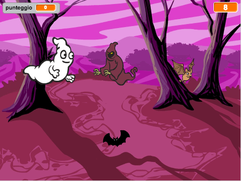
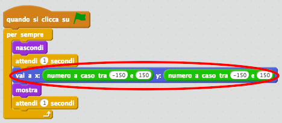
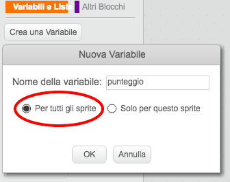
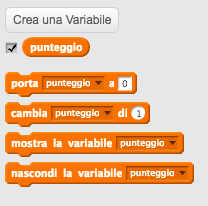
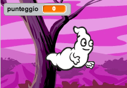
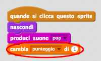
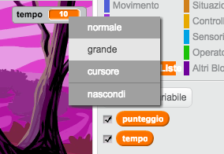

# Introduzione { .intro }

Imparerai a creare un gioco di acchiappa fantasmi!

<div class="scratch-preview">
  <iframe allowtransparency="true" width="485" height="402" src="https://scratch.mit.edu/projects/embed/60787262/?autostart=false" frameborder="0"></iframe>
  
</div>

# Passo 1: Animare un fantasma { .activity }

## Lista di controllo delle attività { .check }

+ Avvia un nuovo progetto Scratch e cancella lo sprite del gatto, in modo che il tuo progetto sia vuoto. Puoi trovare l'editore Scratch online a <a href="http://jumpto.cc/scratch-new" target="_blank">jumpto.cc/scratch-new</a>.

+ Aggiungi un nuovo sprite di fantasma e uno scenario adatto.

	

+ Aggiungi questo codice al tuo fantasma, in modo che appaia e scompaia ripetutamente:

	```blocks
		quando si clicca sulla bandiera verde
		per sempre
  			nascondi
  			attendi (1) secondi
  			mostra
  			attendi (1) secondi
		end
	```

+ Prova il codice del tuo fantasma cliccando la bandiera verde.

## Salva il progetto {.save}

# Passo 2: Fantasmi a caso { .activity }

È facilissimo acchiappare il tuo fantasma perché non si muove!

## Lista di controllo delle attività { .check }

+ Invece di restare nella stessa posizione, puoi fare in modo che Scratch scelga a caso le coordinate x e y. Aggiungi un blocco `vai a` {.blockmotion} al codice del tuo fantasma, in modo che appaia così:

	

+ Prova di nuovo il tuo fantasma e dovresti notare che appare ogni volta in un posto diverso.

## Salva il progetto {.save}

## Sfida: Ancora casualità {.challenge}
Puoi fare in modo che il tuo fantasma `attendi` {.blockcontrol} un periodo di tempo casuale prima di apparire? Puoi usare il blocco `porta dimensione` {.blocklooks} per dare al tuo fantasma una misura casuale ogni volta che appare?

## Salva il progetto {.save}

# Passo 3: Acchiappare i fantasmi { .activity }

Facciamo in modo che il giocatore acchiappi i fantasmi!

## Lista di controllo delle attività { .check }

+ Per permettere al giocatore di acchiappare i fantasmi, aggiungi questo codice:

	```blocks
		quando si clicca questo sprite
		nascondi
	```

+ Prova il tuo progetto. Puoi acchiappare fantasmi man mano che compaiono? Se trovi difficile acchiappare i fantasmi, puoi giocare in modalità schermo intero cliccando questo tasto:

	

## Sfida: Aggiungere un suono { .challenge }
Puoi riprodurre un suono ogni volta che un fantasma viene acchiappato?

## Salva il progetto {.save}

# Passo 4: Aggiungi un punteggio { .activity .new-page }

Rendiamo il gioco più interessante tenendo il punteggio.

## Lista di controllo delle attività { .check }

+ Per tenere il punteggio del giocatore, ti serve un posto dove collocarlo. Una __variabile__ è un posto dove conservare i dati che possono cambiare, proprio come un punteggio.

	Per creare una nuova variabile, clicca sulla scheda 'Scripts', seleziona `Variabili e liste` {.blockdata} e poi clicca 'Crea una Variabile'.

	

	Digita 'punteggio' nel nome della variabile, assicurati che sia disponibile per tutti gli sprite e clicca 'OK' per crearla. Vedrai dunque tanti blocchi di codici che possono esere usati con la tua variabile `punteggio` {.blockdata}.

	

	Vedrai il punteggio in alto a sinistra del quadro.

	

+ Quando si inizia una nuova partita (cliccando la bandiera), dovresti resettare il punteggio del giocatore a 0;

	```blocks
	quando si clicca sulla bandiera verde
	porta [punteggio v] a [0]
	```

+ Ogni volta che si acchiappa una fantasma, devi aggiungere 1 al punteggio del giocatore;

	

+ Esegui di nuovo il programma e acchiappa qualche fantasma. Il tuo punteggio cambia?

## Salva il progetto {.save}

# Passo 5: Aggiungere un timer { .activity }

Puoi rendere il gioco più interessante, dando solo 10 secondi al tuo giocatore per acchiappare più fantasmi possibili.

## Lista di controllo delle attività { .check }

+ Puoi usare un'altra variabile per conservare il tempo rimasto. Clicca sul quadro e crea una nuova variabile chiamata 'tempo':

	

+ Il timer dovrebbe funzionare così:

	+ Il timer dovrebbe iniziare a 10 secondi;
	+ Il timer dovrebbe contare alla rovescia ogni secondo;
	+ Il gioco dovrebbe interrompersi quando il timer raggiunge lo 0.

	Per fare ciò, questo è il codice, che puoi aggiungere al tuo __quadro__.

	```blocks
		quando si clicca sulla bandiera verde
		porta [tempo v] a [10]
		ripeti fino a quando <(tempo) = [0]>
  			attendi (1) secondi
  			cambia [ora v] di (-1)
		end
		ferma [tutto v]
	```

	Il codice `ripeti fino a quando`{.blockcontrol}`tempo`{.blockdata}`= 0`{.blockoperators} si aggiunge così:

	

+ Trascina la tua variabile 'tempo' sul lato destro del quadro. Puoi anche fare clic col tasto destro sulla variabile e scegliere 'large readout' per cambiare il modo in cui il tempo viene visualizzato.

	

+ Chiedi a un amico di provare il gioco. Quanti punti riesce a guadagnare? Se il gioco è troppo facile, puoi:

	+ Dare al giocatore meno tempo;
	+ Ridurre la frequenza con cui i fantasmi appaiono;
	+ Rimpicciolire i fantasmi.

	Prova alcune volte il gioco finché sei soddisfatto con il livello di difficoltà.

## Salva il progetto {.save}

## Sfida: Altri oggetti {.challenge}
Puoi aggiungere altri oggetti al gioco?


Rifletti sull'oggetto da aggiungere. Pensa a:

+ Quanto è grande?
+ Apparirà più o meno spesso rispetto ai fantasmi?
+ Che costume/suono avrà quando verrà acchiappato?
+ Quanti punti guadagnerai (o perderai) per averlo acchiappato?

Se hai bisogno di aiuto per aggiungere un altro oggetto, riutilizza i passi qui sopra!

## Salva il progetto {.save}
